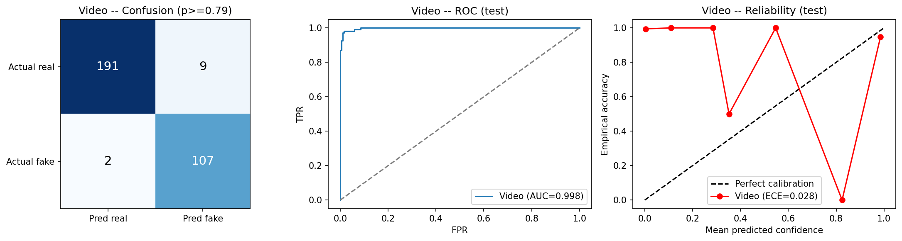
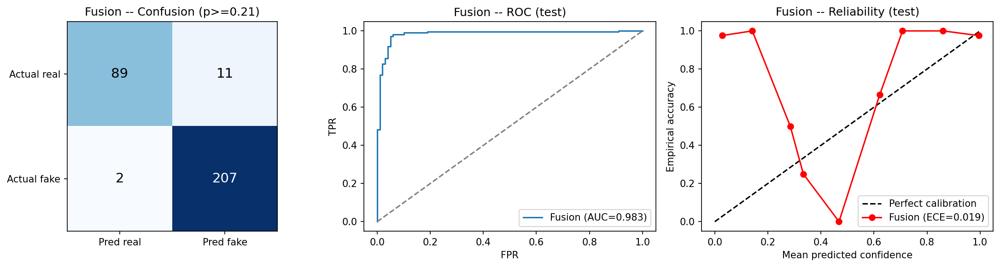
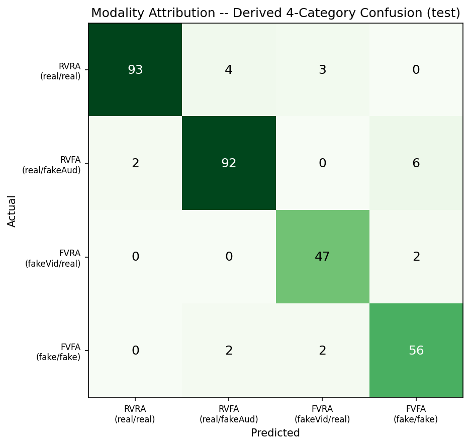

# CrossFuse

Audio-visual deepfake detection. Give CrossFuse a video clip and it tells you whether the face was faked, whether the voice was faked, and whether the clip is fake overall.

On two datasets it never saw during training, Celeb-DF v2 and DFDC, it averages 0.855 AUC. The earlier EfficientNet-B4 baseline, trained on FakeAVCeleb alone, averages 0.610.

## Results

### Unseen datasets (video head, zero-shot)

| Dataset | Clips | EfficientNet baseline | CrossFuse | 95% CI |
|---|---|---|---|---|
| DFDC (sample) | 397 | 0.580 | **0.865** | [0.824, 0.901] |
| Celeb-DF v2 | 400 | 0.640 | **0.845** | [0.781, 0.902] |
| Mean | | 0.610 | **0.855** | |

AUC is the chance that the model scores a random fake higher than a random real clip. 0.5 is a coin flip and 1.0 is perfect. The baseline is the earlier EfficientNet-B4 model, trained on FakeAVCeleb alone. Its intervals do not overlap CrossFuse's on either dataset. The two were not scored identically: the baseline used one 12-frame window per video, CrossFuse averages two windows, so the comparison is close but not exact.

### FakeAVCeleb test set (identities held out, 309 clips)

| Head | AUC |
|---|---|
| Video | 0.998 |
| Fusion | 0.983 |
| Audio | 0.978 |

FakeAVCeleb labels the picture and the sound separately, so every clip is one of four kinds: real/real, real video with fake audio, fake video with real audio, or fake/fake. CrossFuse puts 288 of the 309 test clips in the right one of the four (93%).

## How it works

The input is a 12-frame window of cropped faces plus audio features (MFCC and a log-mel spectrogram).

**Backbone.** The visual encoder is CLIP ViT-L/14. Everything is frozen except its LayerNorm parameters, so very little of the model is actually trained. LNCLIP-DF reports that LayerNorm-only tuning transfers well across deepfake datasets, and Effort gets similar numbers by tuning a different small slice of the same backbone.

**Two training stages.**

1. Pretrain the encoder on FaceForensics++ (real videos plus four manipulation families: Deepfakes, Face2Face, FaceSwap, NeuralTextures). The encoder has to reach 0.85 on Celeb-DF and 0.75 on DFDC, zero-shot, before the next stage may use it. It reached 0.919 and 0.849.
2. Train the full model on FakeAVCeleb with FaceForensics++ clips mixed in. Those clips have no audio, so the audio losses skip them, and they never appear in validation or test.

**Heads.**

| Head | Sees | Answers |
|---|---|---|
| `video` | face frames only | Is the picture manipulated? |
| `audio` | audio only | Is the voice synthetic? Checked on FakeAVCeleb only |
| `fusion` | both, cross-attended | Is the clip fake at all? |
| `sync` | mouth frames and audio | Do the lips match the speech? At chance (0.50 AUC), failed its gate, not used for verdicts |

The video and audio heads never see each other's input. That is what makes the four-way breakdown above trustworthy: when the audio head says the voice is fake, it got there from the sound alone.

## What made the difference

Three things changed compared with the baseline: the backbone, the FaceForensics++ pretraining, and mixing FaceForensics++ into training. An ablation separates them. Each arm is one run with a shorter training budget, scored on the same Celeb-DF and DFDC clips as above.

| Arm | Backbone | FF++ pretraining | FF++ in training mix | DFDC | Celeb-DF | Mean |
|---|---|---|---|---|---|---|
| Full recipe | CLIP | yes | yes | 0.801 | 0.900 | **0.851** |
| No FF++ in the mix | CLIP | yes | no | 0.831 | 0.862 | **0.846** |
| No FF++ pretraining | CLIP | no | yes | 0.785 | 0.716 | 0.750 |
| EfficientNet backbone | EfficientNet-B4 | no | yes | 0.514 | 0.587 | 0.550 |

The pretraining stage looks like the ingredient that matters. Take it away and the mean drops by about 0.10, mostly on Celeb-DF. Take away the FaceForensics++ clips in the training mix and there is no detectable difference: the per-dataset gaps (0.03 to 0.04) sit inside the ±0.05 intervals, and the two arms also got very different amounts of training (about 71 minutes against 426). The EfficientNet arm scored near chance, but it hit its epoch cap and its in-domain video AUC was only 0.727, so it is undertrained and cannot show that the data is useless to that backbone.

One confound remains. The multimodal stage tunes the LayerNorms at a learning rate of 1e-5, ten times lower than the pretraining stage's 1e-4. The no-pretraining arm therefore cannot separate "the dedicated pretraining stage matters" from "the LayerNorms barely moved at the lower rate". Rerunning that arm at 1e-4 would settle it. That has not been done.

## Evaluation setup

- **No identity leakage.** Splits are grouped by person, using union-find over the IDs in folder and file names, so a fake and its source identity always land on the same side. An assertion enforces it.
- **Calibration.** Temperature and decision thresholds are fit on validation with the same 20-sample MC-Dropout estimate used at test time. The visual backbone is run once, deterministically, and the 20 samples vary only the heads' ordinary dropout layers. Dropout inside the transformer and attention layers is not switched on (a unit test documents this), so the spread is narrower than full MC-Dropout.
- **Uncertainty.** The cross-dataset numbers and the ablation scores come with their sample size and a bootstrap 95% interval. The FakeAVCeleb test table above does not.
- **Fixed in advance.** The pretraining gate above was set before the run, not adjusted after.

## Running it

Everything runs as Kaggle notebooks, each publishing its output as a Kaggle Dataset for the next.

| Notebook | Does | Publishes |
|---|---|---|
| `A-extract` | FakeAVCeleb face crops and audio features | `crops-v5` |
| `A3-ffpp-full-extract` | FaceForensics++ face crops, all five families | `ffpp-crops-v5` |
| `B1-ffpp-pretrain` | CLIP pretraining on FaceForensics++, with the gate | `ffpp-encoder-v5` |
| `B-train` | Full multimodal training | `crossfuse-v5-ckpt` |
| `C-eval` | Calibration, test report, cross-dataset evaluation, figures | `results/` |
| `D2-ablation-attribution` | The ablation table above | CSV |

1. Upload `crossfuse_v5.py` and `ffpp_v5.py` as a Kaggle Dataset named `crossfuse-v5-lib`. Notebooks find them by filename, so re-upload after any edit.
2. Run the notebooks in the order above on a Kaggle GPU (one T4 is enough) with Internet on.
3. Use a single GPU. Splitting the CLIP backbone across two was about three times slower.

`B-train` and each full-size ablation arm take several hours, so training stops itself before Kaggle's 9-hour session limit and keeps its best checkpoint.

Offline checks: `pip install -r requirements.txt`, then `python -m pytest tests -q`. It covers the stopping rule, the NumPy metrics against brute-force definitions, identity-disjoint splitting, and the sync-profile and pooling helpers. GitHub Actions runs it on every push. `python verify_sync_fix.py` runs the separate 69 CPU checks for the sync head.

| Path | What is there |
|---|---|
| `crossfuse_v5.py` | Config, data pipeline, model, training loop, evaluation |
| `ffpp_v5.py` | FaceForensics++ discovery, splitting and pretraining |
| `sbi_v5.py` | An earlier pretraining approach, kept for reference and not used |
| `notebooks/` | The pipeline above |
| `results/` | Metrics, calibration, figures and ablation CSVs |
| `CLAUDE.md` | Working notes and full project history |

## Notes on the numbers

- The FakeAVCeleb test split has only two identity groups, so 309 clips overstate how much independent evidence there is, and the 288/309 figure comes from those same two groups. The audio head has only been checked on FakeAVCeleb.
- Training turns a quarter of the real windows into "fake" with a lightweight self-blend, in every run including the ablation arms. It is a standing ingredient that the ablation does not isolate.
- Celeb-DF is mostly fake clips, so its 0.868 accuracy at the FakeAVCeleb threshold sits near what predicting "fake" every time would score. Compare models by AUC.
- Celeb-DF and DFDC guided the method choices as well as scoring them, so "zero-shot" is slightly generous.
- Each configuration is one training run. The bootstrap intervals are about ±0.05, so gaps smaller than that are not meaningful.
- Ranking transfers better than the yes/no cutoff. The decision threshold is fit on FakeAVCeleb, and at that threshold DFDC accuracy is only 0.56 even though AUC is 0.865. Compare models by AUC.
- The full-recipe and no-pretraining ablation arms stopped at their time limit, and the EfficientNet arm stopped at its epoch cap, so treat their scores as lower bounds.

## Data and references

Datasets: FakeAVCeleb (training), FaceForensics++ c23 (pretraining and training mix), Celeb-DF v2 and the DFDC sample (evaluation). None are redistributed here.

- LNCLIP-DF, [arXiv:2508.06248](https://arxiv.org/abs/2508.06248)
- Effort, [arXiv:2411.15633](https://arxiv.org/abs/2411.15633)
